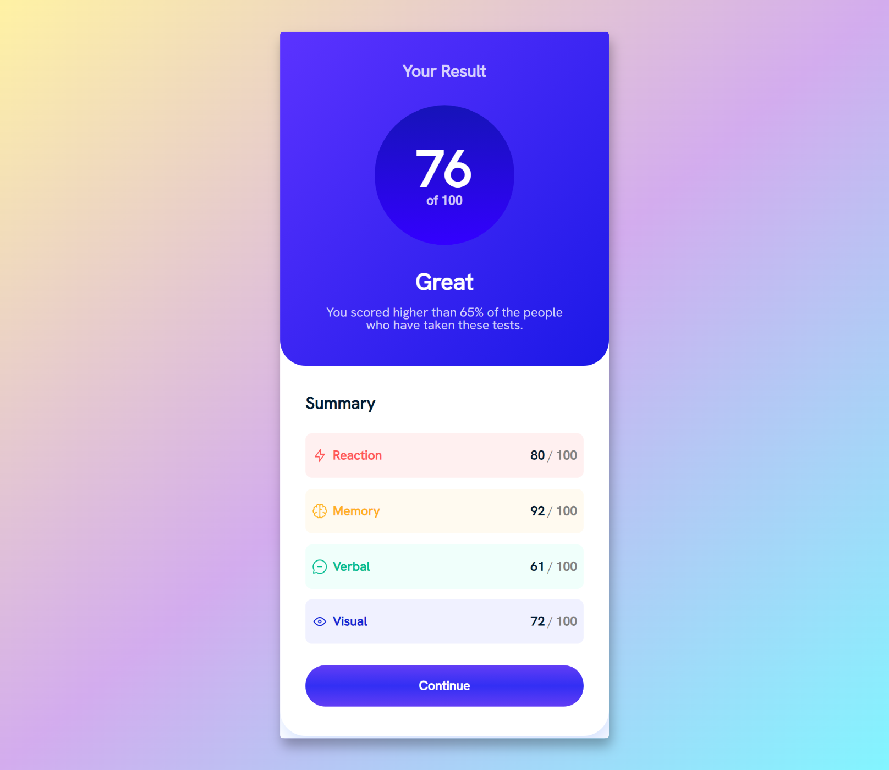

# Componente de sumario de resultados
> README en español: ./ES-README.md

Esta es una solución al challenge de Frontend Mentor
- [URL del Challenge](https://www.frontendmentor.io/challenges/results-summary-component-CE_K6s0maV)
- [URL del sitio en vivo](https://rtlsalazar.github.io/responsive-summary-component/dist/index.html)

### Construido con
- HTML5 semántico
- CSS Grid
- Vite

### Captura de pantalla
#### Desktop

#### Mobile

