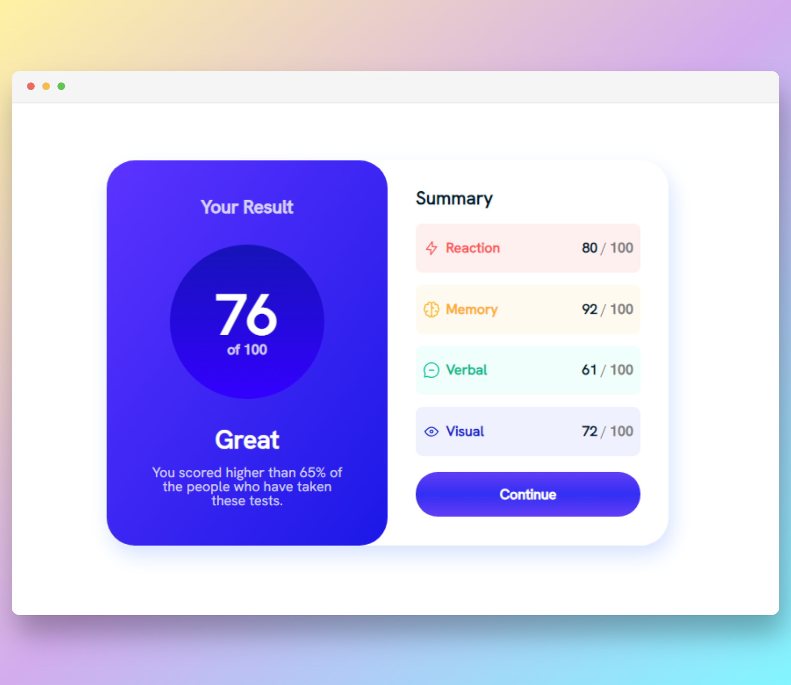
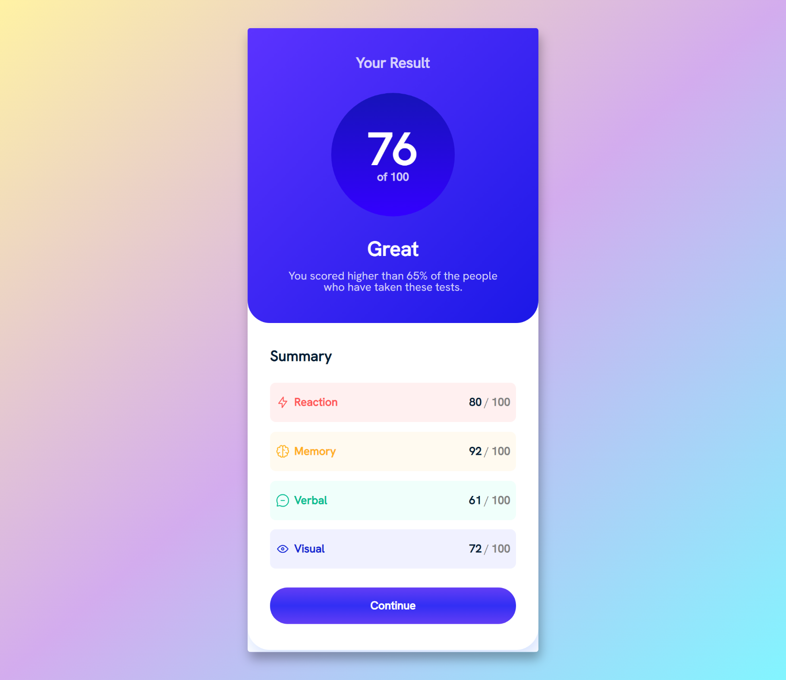

# Results summary component
> README en espanol: [ES-README.md](./ES-README.md)

This is a solution to the Results summary component challenge on Frontend Mentor
- [Challenge URL](https://www.frontendmentor.io/challenges/results-summary-component-CE_K6s0maV)
- [Live Site URL](https://rtlsalazar.github.io/responsive-summary-component/dist/index.html)

### Built with

- Semantic HTML5 markup
- CSS Grid
- Vite

### Screenshot
#### Desktop

#### Mobile

